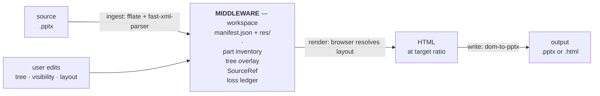
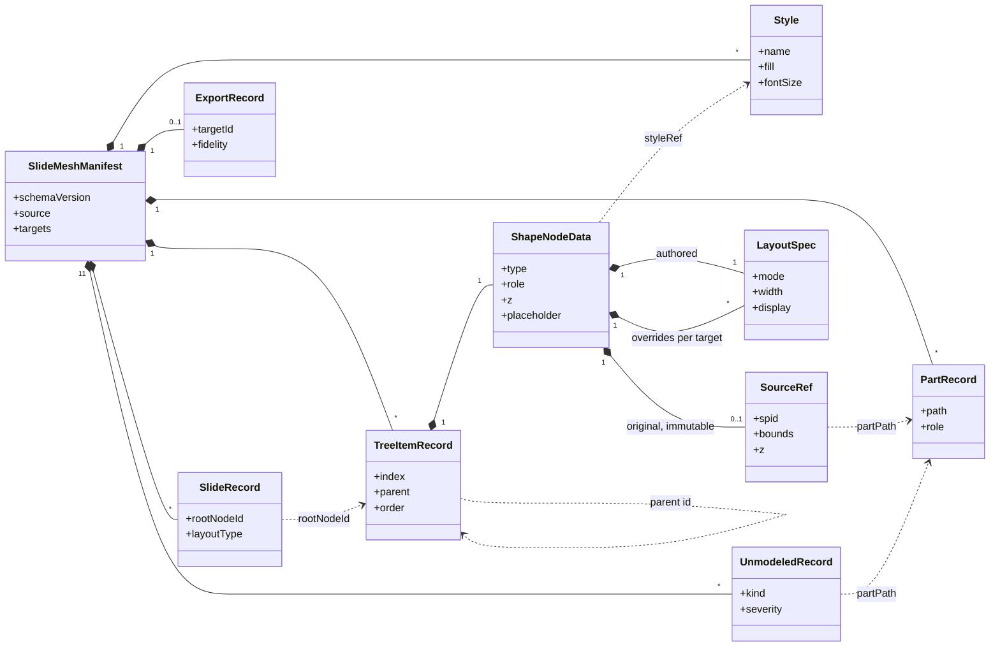
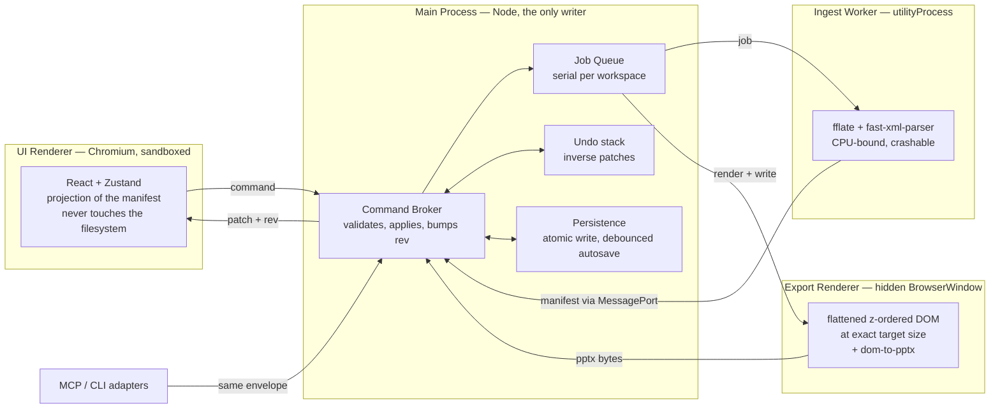

# SlideMesh — Requirements & Design

**Status:** draft, pre-implementation. Nothing here has been validated against a real `.pptx`.
**Progress and current state:** [CHECKPOINT.md](CHECKPOINT.md). This document holds requirements and design only.

### Contents

**Part I — What it must do**

| | | |
| :--- | :--- | :--- |
| [1](#1-purpose) | Purpose | The problem and the shape of the answer |
| [2](#2-glossary) | Glossary | Terms used precisely throughout |
| [3](#3-requirements) | Requirements | FR/NFR ids, budgets, scope boundaries, failure catalog |

**Part II — How it works**

| | | |
| :--- | :--- | :--- |
| [4](#4-pipeline-architecture) | Pipeline | The one-way flow everything else follows from |
| [5](#5-data-model) | Data model | Workspace, manifest, tree, styles — the core of the design |
| [6](#6-export-semantics--pptx) | PPTX export | What the format can and cannot promise |
| [7](#7-export-semantics--html) | HTML export | The structure-preserving output |
| [8](#8-fonts-and-text-fidelity) | Fonts | The largest fidelity risk, and the three mitigations |
| [9](#9-core-api--adapters) | Core API | Conventions fixed, inventory open |
| [10](#10-runtime-architecture) | Runtime | Processes, queue, failure handling |
| [11](#11-technical-stack--project-layout) | Stack & layout | Dependencies, directories, runtime locations |

**Part III — How we know it works**

| | | |
| :--- | :--- | :--- |
| [12](#12-validation--acceptance) | Validation | Gates traced to requirements, plus v1 acceptance thresholds |
| [13](#13-risks) | Risks | What could sink this, and what we do about it |
| [14](#14-architectural-principles) | Principles | The rules the rest of the document obeys |

**Where to start.** Reviewing the concept: §1, §3, §13. Implementing: §5 and §9 first — everything reads or writes the manifest. Judging feasibility: §6, §8, §12 — that is where the honest uncertainty lives.

---

## 1. Purpose

**SlideMesh** is a local desktop application that ingests legacy, absolute-positioned PowerPoint (`.pptx`) files, lets users organize flat shapes into hierarchical container trees, assign responsive layout rules, and compile the result into PowerPoint or HTML at any target aspect ratio.

The problem it addresses: legacy decks are flat lists of absolutely-positioned shapes. Changing aspect ratio, restyling a deck consistently, or reusing a layout means moving every shape by hand on every slide. SlideMesh adds the structure the format never had — containment, shared styles, reflow — and compiles it back out.

---

## 2. Glossary

| Term | Meaning |
| :--- | :--- |
| **Workspace** | A folder holding `manifest.json` plus `res/`, the unzipped `.pptx`. The durable artifact; what the user saves and reopens. |
| **Manifest** | The JSON descriptor of a workspace: part inventory, tree, styles, loss ledger. |
| **Node** | One entry in the tree — a shape, text frame, image, or container. |
| **Container** | A virtual node holding no pixels, grouping children so they move and reflow together. |
| **Root** | The synthetic container at the top of each slide's tree. Exactly one per slide. |
| **Target** | A named export aspect ratio, `{ label, cx, cy }` in EMU. |
| **Loss ledger** | `unmodeled[]` — the record of everything the model cannot represent. |
| **`SourceRef`** | A node's immutable provenance and original geometry from the deck. |
| **EMU** | English Metric Unit, 914 400 per inch. How PPTX stores geometry. |
| **`spid`** | A shape's `p:cNvPr/@id`, unique within its slide. |
| **Patch** | The set of changed records a mutation returns, instead of a whole document. |
| **`rev`** | Monotonic manifest revision, used for optimistic concurrency. |

---

## 3. Requirements

Requirement ids are referenced by the validation gates in §12.

### 3.1 Functional

| Id | Requirement | Priority |
| :--- | :--- | :--- |
| **FR-01** | Ingest a `.pptx`, unzip it to a workspace, and inventory every archive part. | Must |
| **FR-02** | Parse slide XML into a node tree with original geometry, z-order, and provenance. | Must |
| **FR-03** | Record every part or shape the model cannot represent in the loss ledger, with severity. | Must |
| **FR-04** | Present the tree in a dependency view supporting drag-to-reparent and reorder. | Must |
| **FR-05** | Toggle per-node visibility without modifying the source deck. | Must |
| **FR-06** | Create authored containers grouping arbitrary nodes, nested arbitrarily deep. | Must |
| **FR-07** | Assign layout rules (flex/grid participation, sizing, constraints) via a property panel. | Must |
| **FR-08** | Define deck-wide named styles and assign them by reference, so one edit restyles every member. | Must |
| **FR-09** | Present a style view grouping nodes by shared style, with shared selection across views. | Must |
| **FR-10** | Preview the deck live at multiple viewports. | Must |
| **FR-11** | Export `.pptx` at any user-defined target ratio. | Must |
| **FR-12** | Warn before export, listing ledger rows that will cause visible loss. | Must |
| **FR-13** | Save and reopen a workspace with no loss of tree, styles, or layout. | Must |
| **FR-18** | Extract embedded fonts from the source deck and render text with them. | Must — the font risk mitigation in §8 and §13 depends on it |
| **FR-14** | Export a self-contained HTML deck player (§7). | Should |
| **FR-15** | Undo and redo any mutation. | Should |
| **FR-16** | Store per-target layout overrides for nodes that need to differ at one ratio. | Should |
| **FR-17** | Drive the same operations through an MCP adapter. | Could |

### 3.2 Non-functional

Budgets are **targets to validate**, not measurements. They exist so §10's process split can be judged against something.

Three caveats. They are not equal in weight: **NFR-02 and NFR-04 are architectural** — the ingest worker and the patch protocol exist to meet them — while memory and manifest size are guardrails that would change no design decision if they moved by 2×. A duration budget is meaningless without hardware: all timings assume a **reference machine** (current-generation laptop, 8 performance cores, SSD), with CI permitted a 2× allowance rather than being exempt. And **latency is a property of each API method, not of the app** — see §3.2.1.

| Id | Requirement | Budget |
| :--- | :--- | :--- |
| **NFR-01** | Deck scale supported | 200 slides / 50 MB archive / 5 000 nodes |
| **NFR-02** | Ingest time, backgrounded and cancellable | ≤ 5 s for a 60-slide, 20 MB deck |
| **NFR-03** | UI stays responsive during ingest and export | No frame > 100 ms in the UI renderer |
| **NFR-04** | Per-method latency | Each method meets its class budget (§3.2.1) at NFR-01 scale |
| **NFR-05** | Preview reflow after a style or layout edit | ≤ 100 ms |
| **NFR-06** | Export duration | ≤ 10 s for a 60-slide deck |
| **NFR-07** | Memory, all processes combined, 60-slide deck | ≤ 1.5 GB RSS |
| **NFR-08** | Manifest size | ≤ 10 MB at NFR-01 scale |
| **NFR-09** | Crash isolation | A malformed deck fails its job; the app and open workspace survive |
| **NFR-10** | Durability | No save can truncate a manifest; a crash loses at most the last debounce interval |
| **NFR-11** | Privacy | No network access at runtime. All processing is local. |
| **NFR-12** | Security | `contextIsolation` on, `nodeIntegration` off, sandboxed renderers, preload surface of exactly two functions |

#### 3.2.1 Latency classes

Work varies by orders of magnitude across the API — a reparent touches one record, an ingest walks a 50 MB archive — so each method is assigned a **latency class**, and the class carries a budget *and* an API shape.

| Class | Budget (p95, at NFR-01 scale) | API shape | UI affordance |
| :--- | :--- | :--- | :--- |
| **Immediate** | ≤ 50 ms | Returns data synchronously | None — the result is simply there |
| **Prompt** | ≤ 500 ms | Returns data synchronously | Busy state permitted, no progress |
| **Deferred** | > 500 ms | Returns `{ jobId }`, streams progress, cancellable | Progress and cancel, always |

**The governing rule: a method that misses its class changes class, it does not get a bigger budget.** If `presentation.save` grows past 500 ms on large decks, it becomes a job with progress — the budget is not relaxed to 2 s. This is what keeps §10's async contract honest rather than aspirational, and it makes the class assignment a design decision rather than a measurement artifact.

| Method | Class | Why |
| :--- | :--- | :--- |
| `tree.reparent`, `tree.setVisibility`, `tree.setLayout` | Immediate | One-record patch; the flat parent-pointer tree exists to make this true (§5.1) |
| `style.assign`, `target.create`, `presentation.close` | Immediate | Constant work regardless of deck size |
| `style.update` | Immediate | Patch is one style entry however many nodes reference it (§5.8). The resulting *repaint* is NFR-05, measured separately |
| `tree.group`, `tree.ungroup` | Immediate ≤ 50 nodes, else Prompt | Work scales with selection size, not deck size |
| `presentation.save` | Prompt | Serialize and atomically rewrite `manifest.json` in place, up to 10 MB. No workspace relocation: the location was fixed at import |
| `export.preflight` | Prompt | Reads the ledger; no rendering, no writing |
| `presentation.open` | Deferred | Unzip, parse, build manifest on the import branch — NFR-02 |
| `export.run` | Deferred | Render, scrape, write — NFR-06 |

Two measurement rules, so the numbers mean what they say. **Latency is measured at the broker boundary** — command received to patch emitted — excluding the renderer's repaint, which has its own budget (NFR-05); otherwise a slow React render would masquerade as a slow API. And **every class budget is stated at NFR-01 scale**, since a method that is Immediate on 10 slides and Prompt on 200 is really a Prompt method.

### 3.3 Out of scope for v1

Charts, SmartArt, animations and transitions, embedded video, slide-master editing, multi-user or cloud sync, and OLE objects. These are **detected and ledgered** at ingest (§5.3), never silently dropped.

**No free-form dragging on the preview canvas.** Drag-and-drop applies to the *tree* — reordering and reparenting, which genuinely change DOM order and nesting. Geometry is edited only through the property panel. Dragging a shape to arbitrary coordinates would contradict the flex/grid container that owns its position, breaking the auto-layout the product exists to provide.

### 3.4 Assumptions and constraints

* The source format is OOXML `.pptx`. Legacy binary `.ppt` is a different format and is rejected at ingest, not partially parsed.
* Export fidelity is bounded by `dom-to-pptx` and by browser text metrics (§6, §8). The product promises a *redesigned* deck, not a byte-preserved one.
* Single user, single machine, one workspace open at a time.
* Fonts are resolved from the deck's embedded data where present, otherwise from the host machine via a metric-compatible substitution table (§8). We do not install system fonts, and do not re-embed fonts into exported decks.

### 3.5 Input failure catalog

Every case maps to an API error code (see [`doc/api/core-api-spec.md`](doc/api/core-api-spec.md) §5), and every code carries documented remediation — **an error a user cannot act on is a defect.** The remediation strings live beside the code enum in `src/core/api/errors.ts`; the UI resolves them locally rather than looking anything up over the network (NFR-11).

| Input | Behavior | Code |
| :--- | :--- | :--- |
| Password-protected / encrypted `.pptx` | Rejected with an explanation; no partial workspace left behind | `PARSE_ERROR` |
| Legacy binary `.ppt` | Rejected, with a note that it must be converted first | `UNSUPPORTED` |
| Corrupt or truncated archive | Rejected; the ingest worker's crash does not take down the app | `PARSE_ERROR` |
| Valid archive, unreadable slide XML | Workspace opens; the affected slide is ledgered `blocking` | — |
| Deck beyond NFR-01 scale | Opens with a warning that budgets are exceeded | — |
| Missing linked media | Node ledgered `contentLoss`, `restorable: false` | — |
| Missing font, not embedded | Metric-compatible substitute used; ledgered `cosmetic`; preflight warns (§8) | — |
| Embedded font present but undecodable | Falls through to substitution; ledgered `cosmetic` | — |
| Disk full or read-only output path | Export fails without a partial file | `IO_ERROR` |

---

## 4. Pipeline Architecture

Everything follows from one property: **the pipeline is one-way.** Export generates a new deck from our HTML rather than editing the source archive, so structure does not flow backwards.

The middleware is the durable artifact — what users save and reopen. Everything downstream of it is regenerated on demand.

| Stage | Owner | Notes |
| :--- | :--- | :--- |
| Ingest | `src/core/parser/` | Unzip, inventory parts, parse slide XML into the tree, ledger what we cannot model. |
| Middleware | on disk | `manifest.json` beside `res/`, the unzipped parts. Survives sessions; §5. |
| Render | `src/core/compiler/` | Tree → absolutely-positioned HTML at the target size. Where fidelity is won or lost. |
| Write | `src/export-renderer/` | `dom-to-pptx` scrapes the rendered DOM. Renderer-side by necessity — §6. |

**The exported `.pptx` is a build output, like a compiled binary.** It is never re-imported as a source of hierarchy; reopening a project means reopening the workspace.

---

## 5. Data Model

### 5.1 The working set

Ingest produces two artifacts on disk, not just an in-memory model:

    workspace/
      manifest.json   the descriptor — ours
      res/            the unzipped .pptx, every part verbatim — theirs
        [Content_Types].xml
        _rels/
        ppt/
        docProps/

**Ours and theirs are separated, one level apart.** Everything from the source archive lives under `res/`, untouched; the manifest sits beside it. Three things follow: re-packaging a workspace into a `.pptx` is simply *zip `res/`* — no file to exclude by name, no chance that a deck legitimately containing a root `manifest.json` collides with ours; `PartRecord.path` stays exactly as the archive names it, so nothing is rewritten on the way out; and it is obvious at a glance which bytes are the user's original. Joining a part path to disk is a single constant prefix.

**Every path in the manifest is relative.** The workspace is a user-owned document that can be moved, copied, or committed to version control, so an absolute path stored anywhere inside it is a bug. The originating deck is identified by `sha256` rather than by location; `source.relPath` is optional and advisory — a convenience for "reveal the original", omitted entirely when the source sits outside the workspace tree.

The manifest answers, at any moment: **what did we model, what did we not model, and where did each modeled thing come from.** Three consumers depend on it — the app (to reopen a session), the fidelity baseline (computed from the ledger rather than judged by hand), and any future surgical XML writer (which needs byte ranges to splice into).

**The schema lives in source, not in docs:** [`src/core/model/manifest.ts`](src/core/model/manifest.ts) is the single definition, imported by core, renderer, and adapters alike. Documentation carries the diagram and the reasoning; it never restates the types, because a second copy is a copy that drifts. The JSON Schema used to validate a persisted manifest is *generated* from that file at build time.

**Schema at a glance** — key relationships only.

Solid diamonds are ownership; dashed arrows are references by id — including `TreeItemRecord → TreeItemRecord`, which is a *parent pointer*, not nesting. `source`, `targets`, and `styles` are plain maps on the manifest rather than record types of their own.

Note what is *absent*: resolved geometry, computed per render and never stored (§5.4), and any `children[]` array, derived in memory rather than persisted.

**Tree representation: flat, parent-pointer canonical.** `tree` is a flat list; each record carries `parent` and `order`, and no record holds a `children` array.

* **A reparent or reorder writes exactly one record.** Storing `children[]` on the parent would rewrite two arrays per move and record the same relationship twice — two sources of truth that can disagree.
* **`order` is a fractional key, not an integer index** — a base-62 string compared lexicographically, so inserting between `"a0"` and `"a1"` yields `"a0V"` and no sibling is renumbered.
* **Keys are compacted periodically.** Dragging back and forth grows keys about one character per interleave. `compactSiblings()` reassigns evenly spaced minimum-width keys across **one sibling group**, preserving order and returning only changed records. It fires past `MAX_ORDER_KEY_LENGTH` ([`order-key.ts`](src/core/model/order-key.ts)), at save time rather than mid-drag (rewriting keys under an in-flight drag would move rows beneath the cursor). Whole-tree compaction is deliberately not the default: it would rewrite every record and bury the user's edit in the diff.
* **`children[]` is derived in memory** at load (group by `parent`, sort by `order`) because `react-complex-tree` wants that shape.

Parent pointers permit cycles, so four invariants are checked at load: exactly one node per slide with `parent === null`, no cycles, every `parent` resolves, and `order` is unique among siblings.

### 5.2 `SourceRef` — provenance and source geometry, together

Part path, `spid`, xpath, an optional byte range, plus original bounds, `z`, rotation and flips. Provenance and geometry live in one record because neither is meaningful without the other, and both are written once at ingest and never edited.

The identity half is the **join key** across three representations — original XML, rendered HTML, exported shape — which is what allows a one-way lossy export to still be reconciled against its input, and what a surgical writer would splice into if the write path is ever replaced.

### 5.3 `unmodeled[]` — the loss ledger

Every part or shape the model cannot carry gets a row with a `kind`, a `severity` (`cosmetic` / `contentLoss` / `blocking`), and a `restorable` flag — **written at ingest, not discovered at export.** Three consequences: the fidelity baseline becomes computable, the user is warned *before* a file is written, and "every skipped part has a row" becomes a test assertion rather than a hope.

### 5.4 Original versus computed

Every property falls into one of three classes, and the split decides what is persisted and what export must care about:

| Class | Examples | Persisted? | At export |
| :--- | :--- | :--- | :--- |
| **Original** — the deck's truth | `SourceRef`: bounds, `z`, rotation, flips, `spid`, byte range | Yes, written once, **immutable** | The baseline fidelity is measured against |
| **Authored** — the user's intent | `layout`, `styleRef`, `z`, `isVisible`, `overrides` | Yes | Determines what gets rendered |
| **Computed** — derived from both | Resolved geometry, `children[]`, effective style, global paint order, style-view grouping | **Never** | **Ignored** — recomputed from the DOM |

**Computed properties are neglected at export**, and that is the point: `dom-to-pptx` scrapes the geometry the browser already resolved, so nothing derived needs to be stored, versioned, or kept consistent. Whenever a value could be recomputed, it is — a stored copy is one more thing that can disagree with its source.

Keeping original separate from authored matters equally: collapsing them would destroy provenance on the first edit and leave the fidelity comparison with nothing to compare against.

**Computed values, built at load or per render, never written:**

* **`children[]`** — grouped from `parent`, sorted by `order` (§5.1).
* **The node → slide index** — a node's slide is defined by walking `parent` to a root and matching `SlideRecord.rootNodeId`. Since "render slide 7" and "every title on every content slide" need that grouping constantly, it is built once per load as an index, rather than stored on each node or re-walked on every query.
* **Effective style** — `styleRef` resolved against `styles`, then `styleOverrides` applied.
* **Global paint order** — the depth-first walk honoring sibling `z` (§5.7).
* **Style-view grouping** — a projection over `styleRef` (§5.9).
* **Resolved geometry** — where a node lands at a given target ratio.

**Serialization is explicit, never a dump of the live model.** The in-memory model is *allowed* to carry computed properties for performance — the slide index above is exactly that, and more will be added as profiling demands. That freedom is only safe if writing the manifest cannot accidentally capture them, so persistence goes through a serializer that emits named original and authored fields and nothing else. `JSON.stringify(model)` is a bug, not a shortcut: it would freeze a cache into the document, where it would be reloaded as though authoritative and then drift from the data it was derived from.

The same rule protects the schema's `ext` contract, since a serializer that enumerates known fields must also copy `ext` bags through verbatim. §12 tests both directions: no computed key ever appears in a written manifest, and unrecognized `ext` data survives a save.

In `ShapeNodeData` the split is visible field by field: `source` is original and absent on authored containers; `z`, `opacity`, `isVisible`, `layout`, `overrides`, `styleRef`, and `styleOverrides` are authored, with `z` and `layout` seeded from `source` at ingest. Field-level detail is in [`manifest.ts`](src/core/model/manifest.ts) and deliberately not repeated here.

`LayoutSpec` is deliberately small — reflow intent, not a mirror of CSS. One type covers a node's behavior as an item (`mode`, `width`/`height`, min/max, `aspectLock`, `align`, `grow`, `order`, `gridArea`, `margin`) and as a container (`display`, `direction`, `wrap`, `gap`, `padding`, `justify`, `alignItems`, `templateColumns`/`templateRows`); the container half is meaningful only when `display` is set.

**Units follow the same split.** Source geometry is EMU. Authored sizes are plain CSS strings — `"50%"`, `"1fr"`, `"auto"`, `"24pt"`, `"120px"` — because the browser resolves layout and we hand the result to the exporter. Fixed px converts at 9525 EMU/px.

### 5.5 Export targets and per-ratio overrides

`targets` is a map of `{ label, cx, cy }` keyed by a stable id that per-ratio overrides attach to.

**One rule set, sparse overrides.** A node's `layout` is authored to work at any ratio; `overrides[targetId]` stores only the properties that genuinely differ. A target absent from the map inherits `layout` unchanged, which should be the common case. This keeps the manifest small and gives one place to edit, rather than N full copies drifting apart.

### 5.6 Containers are virtual, and there is always a root

Containers hold no pixels. They answer "what moves and reflows together," which lets groups nest inside a shared outer container, and lets several containers combine into a larger one — arbitrarily deep.

Every slide has **exactly one virtual root container, never a forest.** A guaranteed single root makes "apply a rule to everything," "reparent the top level," and "wrap the whole slide" ordinary operations instead of special cases.

Three kinds are distinguished so that what the *deck* grouped is never confused with what the *user* organized:

| `type` | Origin | Notes |
| :--- | :--- | :--- |
| `root` | Synthetic, one per slide | Cannot be deleted or reparented. |
| `group` | Mirrors a `p:grpSp` from the deck | Carries a `SourceRef`. |
| `container` | Invented in the tree view | The product's whole point. |

### 5.7 Depth, transparency, and regional masks

Slides use depth and transparency as organizing devices rather than decoration, so both are first-class: `z` and `opacity` sit on every node, and `role` marks nodes that are stacking devices rather than content (`mask`, `backdrop`, `guide` — guides never export).

**Masks are regional, not global.** Each container carries its own mask covering its own area, and those masks share a single style definition. A slide-wide mask spanning containers is deliberately not the pattern.

That practice choice keeps the model simple. A global mask would have to paint *between* two objects sharing a container — forcing stacking and containment onto separate axes, forbidding containers from ever creating a CSS stacking context, and making container opacity a hazard. With regional masks the two axes coincide:

* **`z` ranks a node among its siblings**, not across the slide.
* **Containers may freely use opacity, transform, and filter.** Isolation is harmless when nothing needs to interleave across a boundary.
* **Global paint order remains well-defined** — the depth-first walk honoring sibling `z` — and export materializes exactly that order (§6).

*Accepted limitation:* a node cannot paint between two children of a container it does not belong to. This matches the authoring practice rather than constraining it.

**Z-order is captured at ingest.** `SourceRef.z` records paint order as declared, immutably, and seeds the node's authored `z`. Legacy decks are flat and overlapping, so this is load-bearing: without it, overlapping elements reorder silently on export and no test would catch it.

### 5.8 Shared styles and batch editing

`styles` is a map of named `Style` entries **deck-wide, not per-slide**; nodes reference one via `styleRef` with optional sparse `styleOverrides`. Changing a definition changes every referencing node, which makes this the batch-edit mechanism: *"set every title to 32pt"* is one edit, not a hunt across slides. Regional masks are the same mechanism in a different costume.

`Style` covers surface (fill, opacity, corner radius, border, backdrop blur, shadow) and **typography** (family, size, weight, italic, line height, letter spacing, color, alignment, transform). The *effective* style of a node — definition plus overrides — is computed, never stored.

**Batch editing works on arrival, without hand-tagging.** Two pieces of the deck's own semantics are read at ingest and never invented: `ShapeNodeData.placeholder` (the shape's `p:ph` type) and `SlideRecord.layoutName` / `layoutType`. Together they let a batch edit be scoped the way users describe it — *"every title on every content slide"* — on a freshly imported deck.

### 5.9 Two views over one model

The same `tree` and `styles` are presented two ways. Neither is a second copy — the style view is a projection, computed as "group nodes by `styleRef`," so nothing can drift.

| | **Dependency view** | **Style view** |
| :--- | :--- | :--- |
| Groups by | Containment — what moves together | Shared appearance — what changes together |
| Depth | Arbitrary; the container hierarchy | Two levels: style → members |
| Drag means | Reparent / reorder | Reassign `styleRef` |
| Answers | "What is inside this card?" | "What else looks like this?" |

Both use the same `react-complex-tree` controller, and selection is shared. Nodes with no `styleRef` collect under an "Unstyled" pseudo-group; members are ordered by slide index, then dependency-tree order.

**A node carries exactly one `styleRef`.** That is what keeps the style view a *tree*: membership partitions the nodes. Multiple styles per node would make it a many-to-many graph no tree control can honestly display, and would make "what does this look like?" depend on resolution order. Per-node deviations use `styleOverrides` instead.

### 5.10 Extensibility

`schemaVersion` bumps only for breaking changes (additive optional fields do not); string unions are open so unknown values degrade gracefully instead of failing to parse; every major record carries a namespaced `ext` bag that readers must preserve even when they do not understand it.

---

## 6. Export Semantics — PPTX

`dom-to-pptx` converts HTML to PPTX; it does not edit an existing `.pptx`. Three consequences define what the feature can promise:

1. **It regenerates rather than edits.** Anything the parser did not model is absent from the output rather than preserved.
2. **It is structurally lossy.** The DOM is flattened into positioned shapes, so the container tree and dependency graph do not survive. Only an own-emitter write path could carry containers through as PPTX group shapes.
3. **It is renderer-side.** A live DOM with real layout and `getComputedStyle` is required, so the write step cannot live in framework-agnostic core.

**Export renders a flattened, z-ordered DOM — not the design DOM.** By export time the browser has resolved geometry, so containers have done their job; the exporter emits leaves as a flat list sorted by paint order, with resolved absolute positions. Since `dom-to-pptx` emits shapes in walk order, handing it a pre-sorted flat list is what guarantees paint order survives — and it sidesteps the containment-versus-stacking conflict entirely, because a flat list has no containment left to conflict with. Nodes with `role: 'guide'` are omitted.

**The promise to the user is "export a redesigned deck," not an edited original** — stated plainly in the UI, with `contentLoss` and `blocking` ledger rows surfaced before the file is written.

**Any user-set aspect ratio is supported.** Target slide size is an export parameter in EMU, defaulting to the source deck's. This is tractable precisely because the browser resolves layout for us. The target is recorded in the manifest — the same project may be exported at several ratios, and fidelity numbers only mean something against a stated target.

---

## 7. Export Semantics — HTML

HTML is the **structure-preserving** output, and the asymmetry is worth stating plainly: PPTX export flattens the tree; HTML export does not.

| | PPTX | HTML |
| :--- | :--- | :--- |
| Containers | Flattened away | Preserved as nested elements |
| Styles | Baked per shape | Emitted once as CSS classes |
| Masks, z | Materialized in paint order | Native `z-index` and stacking |
| Re-importable | No | Yes — the manifest travels inside the file |

**The output is a deck player, not a document.** One slide per viewport, filling the screen at its aspect ratio, with keyboard and swipe navigation between slides. This is the form closest to what a `.pptx` is, and it keeps "a slide is a fixed frame" true — which the whole layout model depends on. It costs a small navigation runtime inlined in the file; there is no scrolling-document mode in v1.

**Output is a single self-contained `.html` file.** Images and assets inline as data URIs, so the file can be mailed or dropped on a server with nothing beside it. Data URIs add ~33%, so at NFR-01 scale the file can reach hundreds of MB; the estimated size is reported before writing, and a folder-output mode (assets beside the HTML) is offered past a threshold.

**Styles become CSS classes.** The `styles` map emits one class per entry and nodes carry the class name, so the batch-edit relationship survives into the output — editing the deck's CSS afterwards restyles every member, exactly as it did in the app.

**Targets become container queries, not media queries.** Media queries key off viewport dimensions; what varies here is the *slide's* ratio. Each slide is a container, and per-target `overrides` compile into `@container` blocks scoped to it. A deck authored for one ratio produces no queries at all.

**The manifest rides along.** A `<script type="application/json">` block carries the manifest, making the exported HTML re-openable in SlideMesh — the one output that is not a dead end. (Reading it back is not implemented in v1; emitting it costs nothing and keeps the door open.)

Hidden nodes are omitted rather than emitted with `display: none`, so the output contains no content the user chose to remove. Guides are never emitted.

---

## 8. Fonts and Text Fidelity

**This is the largest fidelity risk in the system**, and it is orthogonal to `dom-to-pptx`: Chromium and PowerPoint measure text differently even when they agree on the font. Line breaks, wrap points, and overflow are the visible consequences.

Rather than only warning about this, v1 attacks it at three levels.

**1. Extract the deck's own embedded fonts.** OOXML can embed font data as `ppt/fonts/*.fntdata`, obfuscated by XORing the first 32 bytes against the part's GUID — a documented, roughly twenty-line transform. Ingest de-obfuscates these into the workspace, and the render and export paths register them as `@font-face`. The browser then measures text with *the deck's own font* rather than a guess. Decks whose authors bothered to embed fonts are exactly the ones that cared about fidelity, so this is the highest-yield mitigation available.

**2. Substitute deliberately, with metric-compatible faces.** When a family is neither embedded nor installed, a substitution table picks a metrically identical face rather than letting Chromium choose — Calibri→Carlito, Arial→Liberation Sans, Cambria→Caladea. Metric compatibility means identical advance widths, so wrap points are preserved even though glyph shapes differ.

**3. Bundle a font set for tests.** Fidelity numbers are otherwise machine-dependent: a developer laptop with Microsoft fonts and a CI runner without them produce different line counts on the same fixture, and the baseline becomes noise. The export renderer uses a bundled set during tests so results are reproducible across machines.

**Resolution order,** consequently: embedded font → locally installed family → metric-compatible substitute → browser fallback. Every step below the first is ledgered (`kind: 'font'`, `severity: 'cosmetic'`) naming the family and affected nodes, so `export.preflight` warns *before* a file is written rather than the user discovering re-wrapped titles afterwards.

**Text stays text.** Rasterizing text frames would make wrap differences vanish, but it would break the promise of an *editable* deck. We accept residual drift and measure it (§12).

**Remaining gaps, ledgered rather than silently approximated:**

* **Autofit.** PPTX `normAutofit` shrinks text to fit its frame; CSS has no equivalent. Nodes using it are ledgered and rendered at the declared size.
* **Viewer-side substitution.** The exported deck names a font family; the *recipient's* machine substitutes again if it lacks it. Nothing at export prevents this — it is a property of the format. (Re-embedding fonts into the exported `.pptx` is out of scope for v1 and would carry licensing questions.)

**Mitigation in the model:** `Style.lineHeight` is an explicit multiplier rather than `normal`, and font sizes may be authored in `%`, so a deck can be made resilient to metric drift by construction rather than by luck.

---

## 9. Core API & Adapters

The core exposes a pure TypeScript service API. External protocols (MCP, CLI) communicate through thin adapters. The method inventory will keep growing; the *conventions* are fixed so growth is free. Full contract: [`doc/api/core-api-spec.md`](doc/api/core-api-spec.md).

* **One transport-neutral API, three bindings** — Electron IPC (a single channel with the method in the payload, so adding a method never touches the preload allowlist), MCP tools, and a CLI.
* **`<domain>.<action>` naming**, flat named params, never positional.
* **Type-prefixed ids** (`nd_`, `sl_`, `st_`, `tg_`) so passing a style id where a node id belongs fails validation instead of resolving to nothing.
* **Errors are values, not exceptions** — every response is a discriminated union on `ok`, with a closed vocabulary of stable codes.
* **Mutations return patches, not documents.** A reparent returns one changed record; a batch style edit returns one style entry and zero node records.
* **Optimistic concurrency via `rev`** — a stale `clientRev` is rejected rather than silently overwriting.
* **Long work returns a `jobId`** and streams progress events.

| Method | Params | Data |
| :--- | :--- | :--- |
| `presentation.open` | `path, workspacePath?` | `{ jobId }` |
| `tree.reparent` | `nodeId, newParentId, before?` | `{}` + one-record patch |
| `tree.setLayout` | `nodeId, layout, targetId?` | `{}` — with `targetId`, a sparse override |
| `style.update` | `styleId, props` | `{}` — the batch-edit path |
| `export.preflight` | `targetId?` | `{ warnings[] }` — never writes |
| `export.run` | `outputPath, targetId?` | `{ jobId }` |

---

## 10. Runtime Architecture

Electron gives us processes, not threads, and the split is not stylistic: unzipping a 40 MB deck and walking its XML would stall whatever event loop it runs on, and the exporter needs a real DOM laid out at an exact size.

### 10.1 Why each process exists

| Process | Owns | Why separate |
| :--- | :--- | :--- |
| **Main** | Workspace, manifest, `rev`, job queue, undo stack, filesystem | Single writer means no locks and a strictly monotonic `rev`. Every mutation from every client funnels through one place. |
| **UI Renderer** | React tree, Zustand store, preview | Sandboxed. Holds a *projection*, not a copy of record — applies patches, never writes files. |
| **Ingest Worker** | Unzip, XML parse, manifest construction | CPU-bound and the most likely thing to crash on a malformed deck (NFR-09). Keeping it out of main is what keeps the window responsive (NFR-03). |
| **Export Renderer** | Flattened export DOM, `dom-to-pptx` | Needs a live DOM at exactly the target size, with no user zoom, scroll position, or panel width bleeding in. A hidden `BrowserWindow` makes export deterministic and independent of the UI's state. |

Adapters are not a process role — they translate into the same envelope and go through the same broker, so an agent-driven edit and a click take identical paths, and both produce a patch every subscriber sees (§10.2).

### 10.2 The message queue

One queue per workspace, in main.

* **Mutations run serially; reads run concurrently.** Serialization is what makes `rev` meaningful and removes every race the store could otherwise have.
* **Commands carry `clientRev`.** Stale ones are rejected rather than applied out of order.
* **Coalescing.** Dragging a slider fires dozens of `tree.setLayout` calls a second; identical-target commands collapse to the last one while queued. Without this the undo stack fills with noise and the preview thrashes.
* **Cancellation is first-class.** Every job takes an `AbortSignal`; opening a second deck cancels the first load rather than racing it.
* **Bounded, with backpressure.** A full queue rejects with a retryable error instead of growing without limit.
* **Responses are addressed, state changes are broadcast.** A response goes to its caller alone; a patch goes to every subscriber whatever its origin, because the UI reflects the manifest rather than its own actions — an agent-driven edit must repaint the window. Idempotent patches and monotonic `rev` make broadcasting safe, so no client filters its own echo. `meta.origin` (`ui` / `mcp` / `cli`) exists for attribution and logs, never for routing.

### 10.3 Data movement

* **Binary travels as transferables** over `MessageChannelMain` ports — the ingest worker and export renderer get direct ports to the broker, so archive bytes and generated `.pptx` bytes move without a relay hop.
* **Only patches cross to the UI.** After the initial load the renderer receives changed records, never the whole manifest.
* **Parts stay on disk.** Processes exchange paths and hashes, not file contents, except where bytes are genuinely the payload.

### 10.4 Failure, supervision, recovery

* **Workers are supervised and restartable** (NFR-09). A crashed ingest worker fails its job with `PARSE_ERROR` and is respawned.
* **Writes are atomic** — temp file plus rename — so a crash mid-save cannot truncate the manifest (NFR-10). Autosave is debounced, and order-key compaction runs at that moment rather than mid-edit.
* **The undo stack holds inverse patches**, not snapshots — a few records per step instead of a full document.
* **Jobs are observable.** Every request carries `requestId`, every long job a `jobId`, both appearing in structured logs.

### 10.5 Security posture

`contextIsolation: true`, `nodeIntegration: false`, sandboxed renderers (NFR-12). The preload bridge exposes exactly two functions — `invoke(request)` and `on(event, handler)` — because the API is single-channel with the method in the payload. Adding a method never widens the bridge. The export renderer loads only generated local content, never remote URLs. No network access at runtime (NFR-11).

---

## 11. Technical Stack & Project Layout

| Layer | Technology | Purpose |
| :--- | :--- | :--- |
| **Desktop Shell** | Electron + `electron-vite` | Native integration, fast HMR, secure IPC bridge. |
| **Frontend UI** | React + Vite + TypeScript | Component-driven reactive UI. |
| **State** | Zustand | Store holding the renderer's projection of the manifest. |
| **Tree Component** | `react-complex-tree` | Headless, accessible tree with drag-and-drop and multi-selection. |
| **Ingestion** | `fflate` (ZIP) + `fast-xml-parser` (XML) | Two small, maintained primitives; no PPTX-specific abstraction. Leaves namespace prefixes verbatim. |
| **Export** | `dom-to-pptx` (MIT, on PptxGenJS) | Scrapes computed styles from the rendered DOM into native PowerPoint shapes. |
| **Testing** | Vitest, plus Playwright for export | Vitest reuses the Vite config. Export needs real layout, which jsdom cannot provide. |
| **AI Integration** | Adapter + MCP `2026-07-28` | Decouples agent protocol changes from core domain logic. |

<!-- -->

    slidemesh/
    ├── doc/
    │   └── api/core-api-spec.md         # conventions & rationale (prose only)
    ├── src/
    │   ├── core/                        # Framework-agnostic core domain logic
    │   │   ├── model/
    │   │   │   ├── manifest.ts          # THE schema — imported, not documented
    │   │   │   ├── order-key.ts         # fractional key algebra + compaction
    │   │   │   └── manifest.schema.json # generated from manifest.ts at build time
    │   │   ├── api/
    │   │   │   ├── types.ts            # request/response envelope
    │   │   │   └── errors.ts           # code enum + remediation text (single source)
    │   │   ├── parser/                  # ZIP & XML extraction, manifest construction
    │   │   ├── transformer/             # Tree building & layout resolution
    │   │   ├── compiler/                # HTML generation
    │   │   └── index.ts                 # Single source of truth API barrel
    │   ├── adapters/mcp/                # MCP transport & tool mappings
    │   ├── main/                        # Electron main: the only manifest writer
    │   │   ├── broker.ts                # command validation, patch application, rev
    │   │   ├── queue.ts                 # per-workspace job queue, coalescing, cancel
    │   │   ├── undo.ts                  # inverse-patch stack
    │   │   └── persistence.ts           # atomic write, debounced autosave
    │   ├── workers/ingest/              # utilityProcess: unzip + XML parse
    │   ├── export-renderer/             # hidden BrowserWindow: flat DOM + dom-to-pptx
    │   ├── preload/                     # Secure bridge: invoke() and on()
    │   └── renderer/src/
    │       ├── components/
    │       │   ├── TreeView/
    │       │   │   ├── DependencyView/  # containment hierarchy
    │       │   │   └── StyleView/       # projection: nodes grouped by styleRef
    │       │   ├── DesignStudio/        # layout property panel
    │       │   └── PreviewPane/         # multi-viewport sandbox
    │       ├── store/                   # Zustand projection
    │       └── App.tsx
    ├── test/
    │   ├── fixtures/                    # Synthesized .pptx decks (committed)
    │   └── fonts/                       # Bundled faces for reproducible metrics (§8)
    ├── scripts/
    │   └── gen-schema.ts                # manifest.ts → manifest.schema.json
    ├── electron.vite.config.ts
    ├── package.json
    │
    ├── out/                             # electron-vite bundle output          — ignored
    ├── dist/                            # electron-builder installers          — ignored
    ├── coverage/                        # Vitest coverage                      — ignored
    ├── test-results/                    # Playwright artifacts                 — ignored
    └── playwright-report/               # Playwright HTML report               — ignored

`out`, `dist`, and `coverage` are already ignored; `test-results/` and `playwright-report/` must be added to `.gitignore`.

### 11.1 Runtime directories

Build output is not the only thing written at runtime, and none of it belongs in the repository tree.

| Location | Holds | Lifetime |
| :--- | :--- | :--- |
| **The workspace** — user-chosen path | `manifest.json` and `res/` (§5.1) | The user's document. Persists until they delete it. |
| `app.getPath('userData')/scratch/<jobId>/` | Export intermediates and in-flight job state | Deleted when the job ends; swept on startup after a crash |
| `app.getPath('userData')/recent.json` | Recently opened workspaces, window state | App-managed preferences |
| **Export output** — user-chosen path | The generated `.pptx` or `.html` | Owned by the user; we never manage it |

**The workspace is a user-visible document, not a hidden cache**, and its location is decided at import rather than deferred to a first save. Opening a `.pptx` asks where the workspace goes, **defaulting to a folder beside the source deck** — the place the user already thinks of as where that deck lives. Two consequences: there is no "unsaved workspace" state and no save-as, so `presentation.save` only ever rewrites `manifest.json` where it already sits; and because the default keeps workspace and source together, `source.relPath` is usually a short relative hop like `../Q3 review.pptx`. A workspace can be moved, copied, or version-controlled by the user, so nothing inside it may hold absolute paths (§5.1).

Export never writes into the workspace. The output path is the user's, and a failed export leaves no partial file there (§3.5).

---

## 12. Validation & Acceptance

| Test | Runs under | Asserts | Covers |
| :--- | :--- | :--- | :--- |
| Geometry | Vitest / node | Parsed EMU bounds convert to expected px positions | FR-02 |
| Manifest | Vitest / node | Schema validity; save → reload deep-equal; inventory covers every part; every `spid` resolves; every skipped part has a ledger row | FR-01, FR-03, FR-13 |
| Tree invariants | Vitest / node | Single root, no cycles, parents resolve, sibling `order` unique | FR-04, FR-06 |
| Order keys | Vitest / node | `keyBetween` monotonic; `compactSiblings` order-preserving and idempotent | FR-04 |
| Isolation | Vitest / node | `core` fails to resolve a React, Electron, or MCP import | — |
| Fidelity | Playwright | Load → HTML → export → reparse with our own ingest path; compare shape count, position, text, images within tolerance | FR-11 |
| Text metrics | Playwright | Wrapped line count per text frame matches the source's declared frame, using bundled fonts | §8 |
| Font extraction | Vitest / node | `.fntdata` de-obfuscates to a font the browser accepts; missing families resolve through the substitution table | FR-18 |
| HTML player | Playwright | Slide navigation works; container queries apply per-target overrides; embedded manifest parses | FR-14 |
| Structural smoke | Playwright + CLI | Headless LibreOffice over every export; nonzero exit or empty output means a malformed package | FR-11 |
| Budgets | Playwright | NFR-02, NFR-05, NFR-06, NFR-07 measured on a fixture at NFR-01 scale | NFR-01…07 |
| Latency classes | Vitest + Playwright | Every method meets its declared class budget at NFR-01 scale, measured at the broker boundary; a method exceeding its class fails rather than being re-budgeted | NFR-04 |

**Scope limit on fidelity testing:** it verifies leaf content and geometry only. Hierarchy is flattened on export and is not present in the output to compare against, so structure is validated against the manifest, never against an exported deck.

**No manual "opens clean in PowerPoint" gate.** A human-run check that cannot go in CI decays and gates releases on an unreproducible step. The LibreOffice smoke test is the automated stand-in; PowerPoint-specific pickiness is an accepted blind spot.

**Fixtures are synthesized, not harvested** — decks authored to exercise nested groups, text frames, images, missing fonts, and at least one chart or SmartArt to force ledger rows. Fully committable, no licensing or confidentiality exposure. Tradeoff: they do not surprise us the way genuine legacy files do, so the fidelity baseline is a floor rather than a guarantee.

### Acceptance criteria for v1

Thresholds to be confirmed once the baseline exists; stated now so "good enough" is a number rather than an opinion.

| Criterion | Threshold |
| :--- | :--- |
| Shapes retained through export | ≥ 99% of modeled nodes |
| Position drift at the source ratio | ≤ 1 pt (12 700 EMU) per shape |
| Text content mismatches | 0 for frames not using autofit |
| Ledger completeness | 100% — no part unaccounted for |
| Budgets | All NFR-01…07 met on the largest fixture |

---

## 13. Risks

| Risk | Impact | Likelihood | Mitigation |
| :--- | :--- | :--- | :--- |
| **Export fidelity is worse than the product needs** | Fatal to the thesis | Unknown until measured | Measured first in Phase 1, before anything is built on it. **No pivot threshold is pre-registered** — the call is made on real numbers at the Phase 1 review, deliberately. Fallback paths (hybrid surgical writer, own OOXML emitter) stay reachable because `SourceRef.xmlByteRange` is captured at ingest, so the decision stays cheap to reverse. |
| **Font metrics re-wrap text** | Visible, on nearly every deck | Medium — reduced by embedded-font extraction and metric-compatible substitution | Extract embedded fonts, substitute deliberately, bundle fonts for reproducible tests, warn at preflight (§8) |
| **`dom-to-pptx` limits or abandonment** | Rewrite of the write path | Low — MIT, active, ~230k downloads/month | Write path isolated behind `export.run`; HTML export does not depend on it |
| **Synthesized fixtures hide real-world breakage** | Overconfidence in the baseline | Medium | Baseline stated as a floor; revisit if real decks expose systematic gaps |
| **Chromium layout changes across Electron versions** | Silent fidelity regressions | Medium | Fidelity numbers recorded per export in the manifest, so drift is visible as a regression |
| **`LayoutSpec` grows into a CSS clone** | Complexity without payoff | Medium | Deliberately minimal; additions must be driven by a real deck that needs them |
| **Budgets unmet at NFR-01 scale** | Product feels slow on real decks | Unknown | Budgets are tested, not assumed; process split exists to make them achievable |
| **MCP revision churn** | Adapter rework | Low | Confined to `/src/adapters/mcp/`; version negotiated, not assumed |

---

## 14. Architectural Principles

1. **Core stays framework-agnostic.** `src/core/` imports no React, Electron, or MCP types; all access crosses `src/core/index.ts`. The renderer-side export step is not an exception — the PPTX write is simply not core's job.
2. **Maintainability over black-box plugins — ingest only.** On the `.pptx` → XML → HTML path, unmaintained third-party rendering plugins are rejected: they hide shape mapping and produce bugs we cannot fix. This does not extend to the write path, where `dom-to-pptx` is a deliberate choice.
3. **Protocol churn isolation.** The MCP adapter confines protocol changes to one directory; the revision is negotiated, not assumed.
4. **Deterministic state synchronization.** One writer, serialized mutations, monotonic `rev`. The UI holds a projection, never a second copy of record.
5. **Compute rather than store.** Any value derivable from original and authored data is derived. A stored copy is one more thing that can disagree with its source.
6. **Loss is declared, never silent.** Anything the model cannot carry is ledgered at ingest and surfaced before export writes a file.
